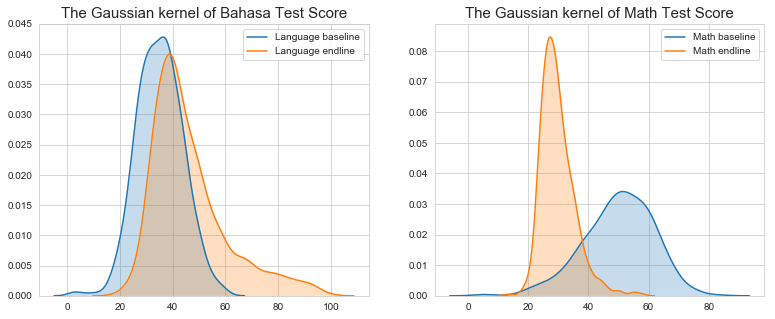

Final Assigment APP- ECEU601003
==========================
### Public Project Analysis Course
* By Redi Sunarta 1606888216 & Dhifani Lutya A 1606829466

---
 *Replicating the data processing of journal about education http://dx.doi.org/10.1257/app.6.2.105.*
*The paper investigates the role of school committees in improving education quality in Indonesia. The study is a randomized evaluation comprising 520 schools in Central Java from 2007 to 2008. They have four main treatments. The first two are novel institutional reforms that improve the social capital of the school committee by strengthening its trustworthiness and relationship with the community (Ostrom and Ahn 2009). The first treatment facilitated democratic elections of school committee members. The second treatment linked school committees to the village council by facilitating joint planning meetings (they call this linkage). The results suggest that fostering ties between the school committee and powerful local groups through joint planning activities could expedite this process and is cost-effective at improving learning.*

#### The Preprocessing Data Process
1.     Determine the variable interest 
2.     Search the variable keyword in questionare
3.     Collecting (from each data in dictionary) 
4.     Merging them in same aggregation (shcool level) 
5.     Do cleansing data 
6.     Modeling
