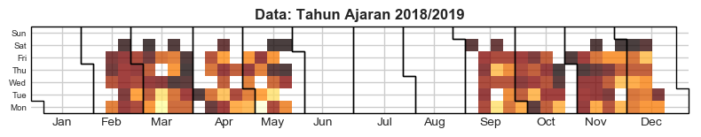

The-Busies-FEUI's-Lecturer
==========================

\*This is my personal project, I will try seek pattern who and when canceling
the class by using twitter data, which usually used by Biro Pendidikan FEB UI to
announce a canceled or reschedule class. However, the main objective of this
task is not to analyze those path but to enhance my personal data wrangling
skills, espesialy using pandas str and regex method.

### Calendar heatmap with **Tweet Created** data.

#####thanks to @rougierrougier for the code
